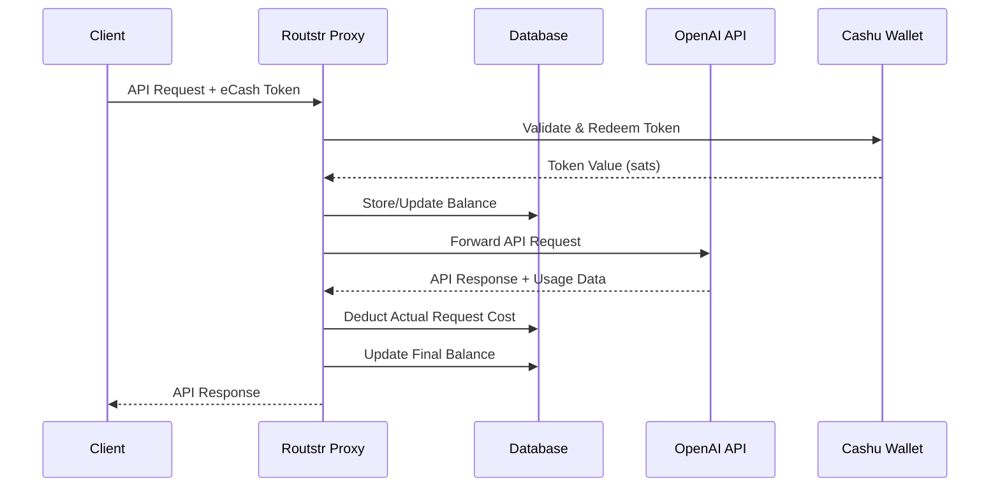
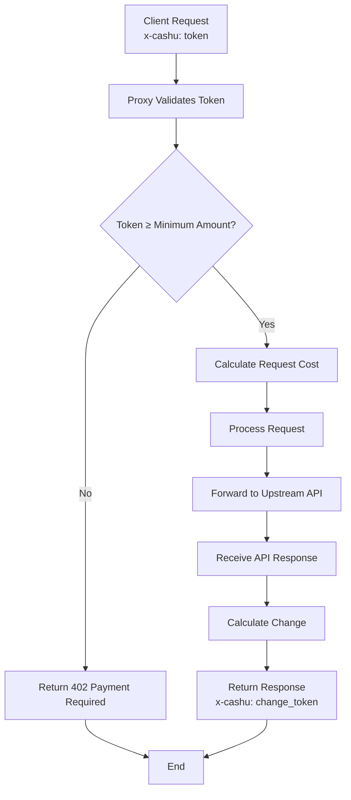

# Routstr Payment Proxy

Routstr is a FastAPI-based reverse proxy that sits in front of any OpenAI-compatible API. It handles pay-per-request billing using the [Cashu](https://cashu.space/) eCash protocol on Bitcoin and tracks usage in a local SQL database.

The server exposes the same endpoints as the upstream API and deducts sats from user accounts for each call. Pricing can be static or model-specific by loading `models.json` (falls back to `models.example.json`).

## How It Works

The proxy implements a seamless eCash payment flow that maintains compatibility with existing OpenAI clients while enabling Bitcoin micropayments:



## Features

- **Cashu Wallet Integration** – Accept Lightning payments and redeem eCash tokens before forwarding requests
- **API Key Management** – Hashed keys stored in SQLite with balance tracking and optional expiry/refund address
- **Model-Based Pricing** – Convert USD prices in `models.json` to sats using live BTC/USD rates
- **Admin Dashboard** – Simple HTML interface at `/admin` to view balances and API keys
- **Discovery** – Fetch available providers from Nostr relays
- **Docker Support** – Provided `Dockerfile` and `compose.yml` for running with an optional Tor hidden service

## Getting Started

### Requirements

- Python 3.11+
- [uv](https://github.com/astral-sh/uv) package manager (used in development)
- A Cashu wallet secret (`NSEC`) and Lightning address for receiving payments

### Installation

```bash
uv sync --dev  # install dependencies
```

Create a `.env` file based on `.env.example` and fill in the required values:

```bash
cp .env.example .env
```

### Running Locally

```bash
fastapi run router --host 0.0.0.0 --port 8000
```

The service forwards requests to `UPSTREAM_BASE_URL`. Supply the upstream API key via the `UPSTREAM_API_KEY` environment variable if required.

### Docker

```bash
docker compose up --build
```

This builds the image and also starts a Tor container exposing the API as a hidden service.

## Environment Variables

The most common settings are shown below. See `.env.example` for the full list.

- `UPSTREAM_BASE_URL` – URL of the OpenAI-compatible service
- `UPSTREAM_API_KEY` – API key for the upstream service (optional)
- `RECEIVE_LN_ADDRESS` – Lightning address that receives payouts
- `MINIMUM_PAYOUT` – Minimum sats before forwarding earnings
- `MODEL_BASED_PRICING` – Set to `true` to use pricing from `models.json`
- `REFUND_PROCESSING_INTERVAL` – Seconds between automatic refunds
- `ADMIN_PASSWORD` – Password for the `/admin` dashboard

## Example Client

`example.py` shows how to use the proxy with the official OpenAI client:

```bash
CASHU_TOKEN=<redeemable token> python example.py
```

The script sends streaming chat completions and pays for each request using the provided token.

## Running Tests

```bash
uv run pytest
```

The tests create a temporary SQLite database and mock the Cashu wallet. See `tests/README.md` for more details.

## Future Features

### Nut-24 Header Support (Coming Soon)

We're implementing support for the Cashu Nut-24 specification, which will enable per-request token exchange with automatic change handling:



**Key Benefits:**
- **Per-Request Payments** – Send exact tokens for each API call
- **Automatic Change** – Receive change tokens in response headers
- **No Pre-funding** – No need to maintain account balances
- **Precise Billing** – Pay only for actual usage with msat-level precision
- **Minimum Amount Protection** – Proxy enforces minimum token value to prevent dust attacks

**Header Format:**
- **Request**: `x-cashu: <ecash_token>` – Token to spend for this request (must meet minimum amount)
- **Response**: `x-cashu: <change_token>` – Change token if payment exceeds cost

**Implementation Note:**
The proxy should implement either a dedicated endpoint to communicate minimum eCash requirements per request, or extend the existing `models.json` to include minimum token amounts per model. This allows clients to autonomously determine the appropriate token amount to send with each request.

**Compatible Clients:**

To use this feature, you'll need a client that handles both OpenAI API calls and eCash header management. The following clients provide seamless integration:

- **[cashu-402-client](https://github.com/9qeklajc/ecash-402-client)** – rust client with automatic wallet management

clients automatically:
- **Handle eCash Headers** – Add `x-cashu` tokens to requests and process change tokens
- **Manage Wallets** – Maintain your Cashu wallet
- **Configure Proxy** – Set Routstr proxy endpoints
- **Top-up Balances** – Automatically request ecash when tokens run low and redeem ecash tokens

This approach eliminates the need for account management while maintaining the security and privacy benefits of eCash payments.

## License

This project is licensed under the terms of the GPLv3. See the `LICENSE` file for the full license text.
