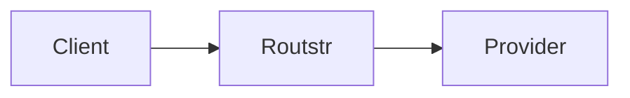

# Routstr Core Documentation

This directory contains the comprehensive documentation for Routstr Core, built with MkDocs.

## Structure

```
docs/
├── index.md                 # Home page
├── getting-started/         # Quick start guides
│   ├── overview.md         # Project overview
│   ├── quickstart.md       # Quick setup guide
│   ├── docker.md           # Docker deployment
│   └── configuration.md    # Configuration options
├── user-guide/             # User documentation
│   ├── introduction.md     # User guide intro
│   ├── payment-flow.md     # Payment process
│   ├── using-api.md        # API usage examples
│   ├── admin-dashboard.md  # Admin interface
│   └── models-pricing.md   # Pricing details
├── contributing/           # Developer documentation
│   ├── setup.md           # Development setup
│   ├── architecture.md    # System architecture
│   ├── code-structure.md  # Codebase organization
│   ├── testing.md         # Testing guide
├── api/                   # API reference
│   ├── overview.md        # API overview
│   ├── authentication.md  # Auth details
│   ├── endpoints.md       # Endpoint reference
│   └── errors.md          # Error handling
└── advanced/              # Advanced topics
    ├── tor.md             # Tor support
    ├── nostr.md           # Nostr discovery
    ├── custom-pricing.md  # Pricing strategies
    └── migrations.md      # Database migrations
```

## Building Documentation

### Requirements

Install MkDocs and dependencies:

```bash
pip install -r docs/requirements.txt
```

Or using the Makefile:

```bash
make docs-install
```

### Local Development

Serve documentation locally with live reload:

```bash
mkdocs serve
# Or
make docs-serve
```

Visit <http://localhost:8000> to view the documentation.

### Building Static Site

Build the static documentation site:

```bash
mkdocs build
# Or
make docs-build
```

The built site will be in the `site/` directory.

### Deploying to GitHub Pages

Deploy documentation to GitHub Pages:

```bash
mkdocs gh-deploy
# Or
make docs-deploy
```

## Writing Documentation

### Style Guide

- Use clear, concise language
- Include code examples
- Add diagrams where helpful
- Keep sections focused
- Test all code examples

### Markdown Extensions

Available extensions:

- **Admonition** - Notes, warnings, tips
- **Code blocks** - Syntax highlighting
- **Mermaid** - Diagrams and flowcharts
- **Tables** - Data presentation
- **Task lists** - Checklists

### Examples

#### Admonitions

```markdown
!!! note
    This is a note.

!!! warning
    This is a warning.

!!! tip
    This is a tip.
```

#### Mermaid Diagrams

```markdown


```

#### Code Blocks

```markdown
```python
def example():
    return "Hello, Routstr!"
```

```

## Contributing to Docs

1. Edit markdown files in the appropriate directory
2. Test locally with `mkdocs serve`
3. Submit PR with changes
4. Documentation auto-deploys on merge

## Resources

- [MkDocs Documentation](https://www.mkdocs.org/)
- [Material for MkDocs](https://squidfunk.github.io/mkdocs-material/)
- [Mermaid Diagrams](https://mermaid-js.github.io/mermaid/)
