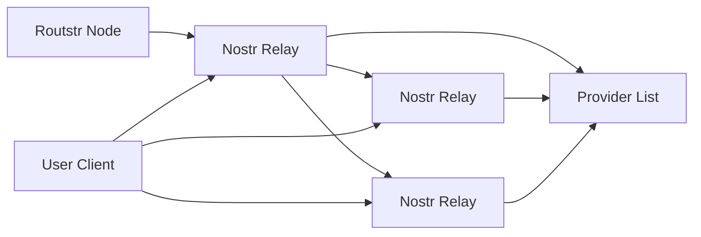

# Nostr Discovery

Routstr Core integrates with Nostr (Notes and Other Stuff Transmitted by Relays) for decentralized provider discovery. This enables users to find Routstr nodes without relying on centralized directories.

## Overview

Nostr integration provides:

- **Decentralized Discovery**: Find providers through relay network
- **Cryptographic Identity**: Providers identified by public keys
- **Real-time Updates**: Live provider status and pricing
- **Censorship Resistance**: No central point of control

## How It Works



Providers announce themselves by publishing signed events to Nostr relays. Clients can query these relays to discover available providers.

## Provider Configuration

### Setting Up Nostr Identity

1. **Generate Nostr Keys**

   ```bash
   # Using nostril or similar tool
   nostril --generate-keypair
   
   # Output:
   # Private key (nsec): nsec1abc...
   # Public key (npub): npub1xyz...
   ```

2. **Configure Environment**

   ```bash
   # .env
   NPUB=npub1xyz...  # Your public key
   NSEC=nsec1abc...  # Your private key (keep secret!)
   NAME=Lightning AI Gateway
   DESCRIPTION=Fast and reliable AI API with Bitcoin payments
   HTTP_URL=https://api.lightning-ai.com
   ONION_URL=http://lightningai.onion
   ```

### Publishing to Nostr

Routstr automatically publishes provider information to configured relays:

```python
# Published event structure (NIP-89)
{
    "kind": 31990,  # Application handler event
    "pubkey": "your_public_key",
    "content": {
        "name": "Lightning AI Gateway",
        "description": "Fast and reliable AI API",
        "endpoints": {
            "http": "https://api.lightning-ai.com",
            "onion": "http://lightningai.onion"
        },
        "models": ["gpt-3.5-turbo", "gpt-4", "claude-3"],
        "pricing": {
            "gpt-3.5-turbo": {
                "prompt_sats_per_1k": 3,
                "completion_sats_per_1k": 4
            }
        },
        "cashu_mints": [
            "https://mint.minibits.cash/Bitcoin"
        ]
    },
    "tags": [
        ["d", "routstr"],
        ["t", "ai-api"],
        ["t", "bitcoin"],
        ["p", "payment-proxy"]
    ]
}
```

### Relay Configuration

Configure which relays to publish to:

```python
# Default relays
DEFAULT_RELAYS = [
    "wss://relay.damus.io",
    "wss://relay.nostr.band",
    "wss://relay.routstr.com",
    "wss://nos.lol"
]

# Custom relay configuration
RELAYS=wss://relay1.com,wss://relay2.com
```

## Client Discovery

### Using the Discovery Endpoint

Find providers through the API:

```bash
GET /v1/providers

Response:
{
  "providers": [
    {
      "name": "Lightning AI Gateway",
      "npub": "npub1xyz...",
      "description": "Fast and reliable AI API",
      "endpoints": {
        "http": "https://api.lightning-ai.com",
        "onion": "http://lightningai.onion"
      },
      "models": ["gpt-3.5-turbo", "gpt-4"],
      "pricing": {
        "gpt-3.5-turbo": {
          "prompt_sats_per_1k": 3,
          "completion_sats_per_1k": 4
        }
      },
      "last_seen": "2024-01-01T12:00:00Z",
      "reliability_score": 0.99
    }
  ]
}
```

### Direct Nostr Queries

Query Nostr relays directly:

```python
import json
import websocket

def discover_providers(relay_url: str):
    """Discover Routstr providers from Nostr relay."""
    ws = websocket.create_connection(relay_url)
    
    # Subscribe to provider events
    subscription = {
        "kinds": [31990],
        "tags": {
            "d": ["routstr"]
        }
    }
    
    ws.send(json.dumps(["REQ", "sub1", subscription]))
    
    providers = []
    while True:
        response = json.loads(ws.recv())
        if response[0] == "EVENT":
            event = response[2]
            providers.append(parse_provider_event(event))
        elif response[0] == "EOSE":  # End of stored events
            break
    
    ws.close()
    return providers
```

### JavaScript/TypeScript

```typescript
import { SimplePool } from 'nostr-tools';

async function discoverProviders(): Promise<Provider[]> {
    const pool = new SimplePool();
    const relays = [
        'wss://relay.damus.io',
        'wss://relay.nostr.band'
    ];
    
    const filter = {
        kinds: [31990],
        '#d': ['routstr']
    };
    
    const events = await pool.list(relays, [filter]);
    
    return events.map(event => ({
        name: event.content.name,
        npub: nip19.npubEncode(event.pubkey),
        url: event.content.endpoints.http,
        models: event.content.models,
        pricing: event.content.pricing
    }));
}
```

## Provider Ranking

### Reliability Scoring

Providers are ranked based on:

```python
class ProviderScore:
    def calculate(self, provider: Provider) -> float:
        score = 1.0
        
        # Uptime (based on recent checks)
        uptime_ratio = provider.successful_pings / provider.total_pings
        score *= uptime_ratio
        
        # Response time
        if provider.avg_response_time < 500:  # ms
            score *= 1.0
        elif provider.avg_response_time < 1000:
            score *= 0.9
        else:
            score *= 0.7
        
        # Model availability
        model_score = len(provider.models) / 10  # Max 10 models
        score *= min(1.0, 0.5 + model_score * 0.5)
        
        # Price competitiveness
        if provider.is_cheapest_for_any_model():
            score *= 1.1
        
        return min(1.0, score)
```

### Provider Selection

Choose optimal provider:

```python
def select_provider(
    providers: list[Provider],
    model: str,
    requirements: dict
) -> Provider:
    """Select best provider for requirements."""
    
    # Filter by model availability
    candidates = [p for p in providers if model in p.models]
    
    # Filter by requirements
    if requirements.get('tor_required'):
        candidates = [p for p in candidates if p.onion_url]
    
    if requirements.get('max_price_per_1k'):
        max_price = requirements['max_price_per_1k']
        candidates = [
            p for p in candidates
            if p.pricing[model]['prompt_sats_per_1k'] <= max_price
        ]
    
    # Sort by score
    candidates.sort(key=lambda p: p.reliability_score, reverse=True)
    
    return candidates[0] if candidates else None
```

## Publishing Updates

### Automatic Updates

Routstr publishes updates when:

- Node starts up
- Configuration changes
- Models are added/removed
- Pricing updates

### Manual Publishing

Force publish current state:

```python
async def publish_provider_info():
    """Manually publish provider information."""
    event = create_provider_event(
        name=os.getenv("NAME"),
        description=os.getenv("DESCRIPTION"),
        models=get_available_models(),
        pricing=get_current_pricing()
    )
    
    await publish_to_relays(event, RELAYS)
```

### Event Lifecycle

```python
# Publish every 6 hours
@periodic_task(hours=6)
async def update_nostr_presence():
    """Keep provider information fresh."""
    try:
        await publish_provider_info()
        logger.info("Updated Nostr presence")
    except Exception as e:
        logger.error(f"Failed to update Nostr: {e}")

# Delete on shutdown
async def remove_nostr_presence():
    """Remove provider from discovery."""
    deletion_event = create_deletion_event()
    await publish_to_relays(deletion_event, RELAYS)
```

## Security Considerations

### Key Management

1. **Secure Storage**

   ```python
   # Never log private keys
   SENSITIVE_VARS = ['NSEC', 'ADMIN_PASSWORD']
   
   def sanitize_env(env_dict: dict) -> dict:
       return {
           k: '***' if k in SENSITIVE_VARS else v
           for k, v in env_dict.items()
       }
   ```

2. **Key Rotation**

   ```bash
   # Generate new keys
   nostril --generate-keypair
   
   # Update configuration
   # Publish transition event
   # Update all references
   ```

### Event Validation

Verify provider events:

```python
def validate_provider_event(event: dict) -> bool:
    """Validate provider announcement."""
    # Check signature
    if not verify_signature(event):
        return False
    
    # Check required fields
    required = ['name', 'endpoints', 'models', 'pricing']
    content = json.loads(event['content'])
    if not all(field in content for field in required):
        return False
    
    # Verify endpoints are reachable
    if not await check_endpoints(content['endpoints']):
        return False
    
    return True
```

### Relay Security

Choose relays carefully:

```python
TRUSTED_RELAYS = {
    'wss://relay.damus.io': {
        'operator': 'Damus',
        'reputation': 'high',
        'filters_spam': True
    },
    'wss://relay.nostr.band': {
        'operator': 'Nostr.Band',
        'reputation': 'high',
        'paid_tier': True
    }
}
```

## Advanced Features

### Multi-Relay Broadcasting

Ensure wide distribution:

```python
async def broadcast_to_relays(event: dict, relays: list[str]):
    """Broadcast event to multiple relays."""
    tasks = []
    for relay in relays:
        task = asyncio.create_task(
            publish_to_relay(event, relay)
        )
        tasks.append(task)
    
    results = await asyncio.gather(*tasks, return_exceptions=True)
    
    successful = sum(1 for r in results if not isinstance(r, Exception))
    logger.info(f"Published to {successful}/{len(relays)} relays")
```

### Provider Metadata

Extended metadata in events:

```json
{
    "kind": 31990,
    "content": {
        "name": "Lightning AI",
        "description": "Enterprise AI API",
        "metadata": {
            "established": "2024-01-01",
            "total_requests": 1000000,
            "average_response_ms": 250,
            "supported_features": [
                "streaming",
                "function_calling",
                "vision",
                "embeddings"
            ],
            "certifications": ["SOC2", "GDPR"],
            "contact": {
                "nostr": "npub1contact...",
                "email": "support@lightning-ai.com"
            }
        }
    }
}
```

### Discovery Filters

Advanced filtering options:

```python
# Find providers with specific features
GET /v1/providers?features=streaming,vision&max_price=5&min_reliability=0.95

# Response includes filtered results
{
    "providers": [...],
    "filters_applied": {
        "features": ["streaming", "vision"],
        "max_price_sats_per_1k": 5,
        "min_reliability": 0.95
    },
    "total_providers": 50,
    "matching_providers": 12
}
```

## Monitoring

### Discovery Metrics

Track discovery performance:

```python
class DiscoveryMetrics:
    def __init__(self):
        self.relay_health = {}
        self.provider_count = 0
        self.query_latency = []
    
    async def check_relay_health(self, relay_url: str):
        """Monitor relay connectivity."""
        start = time.time()
        try:
            await connect_to_relay(relay_url)
            latency = time.time() - start
            self.relay_health[relay_url] = {
                'status': 'healthy',
                'latency_ms': latency * 1000
            }
        except Exception as e:
            self.relay_health[relay_url] = {
                'status': 'unhealthy',
                'error': str(e)
            }
```

### Provider Monitoring

```python
@periodic_task(minutes=5)
async def monitor_providers():
    """Check provider health."""
    providers = await discover_providers()
    
    for provider in providers:
        try:
            # Test endpoint
            response = await test_provider_endpoint(provider.http_url)
            
            # Update metrics
            await update_provider_metrics(
                provider.npub,
                success=response.status_code == 200,
                response_time=response.elapsed
            )
        except Exception as e:
            logger.warning(f"Provider {provider.name} check failed: {e}")
```

## Troubleshooting

### No Providers Found

```python
# Debug discovery issues
async def debug_discovery():
    """Diagnose discovery problems."""
    issues = []
    
    # Check relay connectivity
    for relay in RELAYS:
        if not await can_connect_to_relay(relay):
            issues.append(f"Cannot connect to {relay}")
    
    # Check event publishing
    if not await verify_own_events_visible():
        issues.append("Own events not visible on relays")
    
    # Check filters
    if len(await get_all_provider_events()) == 0:
        issues.append("No provider events on any relay")
    
    return issues
```

### Relay Connection Issues

```bash
# Test relay connection
wscat -c wss://relay.damus.io

# Send subscription
["REQ","test",{"kinds":[31990],"#d":["routstr"]}]
```

## Best Practices

### For Providers

1. **Consistent Identity**
   - Use same npub across services
   - Maintain profile metadata
   - Verify identity on multiple platforms

2. **Regular Updates**
   - Publish status every few hours
   - Update pricing promptly
   - Remove stale information

3. **Relay Diversity**
   - Publish to 5+ relays
   - Include regional relays
   - Monitor relay health

### For Clients

1. **Verify Providers**
   - Check multiple relays
   - Verify endpoints work
   - Monitor reliability over time

2. **Cache Discovery**
   - Cache provider list
   - Refresh periodically
   - Handle stale data gracefully

3. **Fallback Options**
   - Keep backup providers
   - Handle discovery failures
   - Support manual configuration

## Next Steps

- [Tor Support](tor.md) - Anonymous provider access
- [Custom Pricing](custom-pricing.md) - Dynamic pricing strategies
- [API Reference](../api/endpoints.md) - Discovery API details
