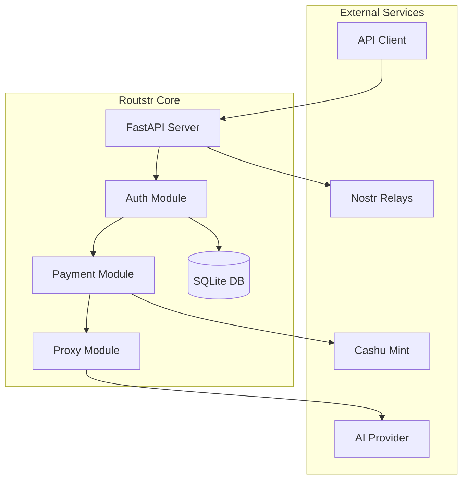
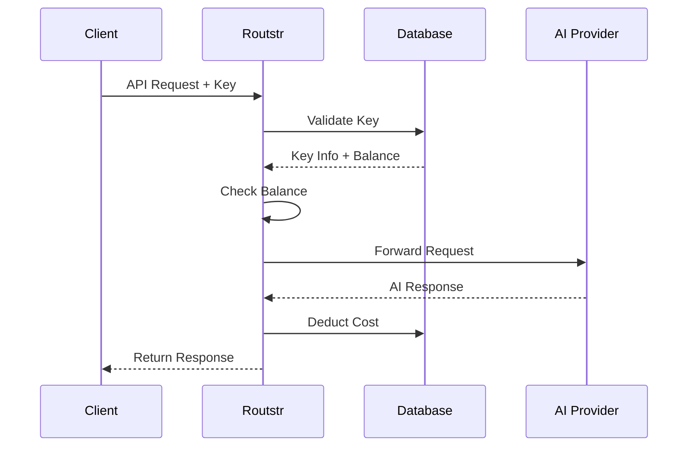
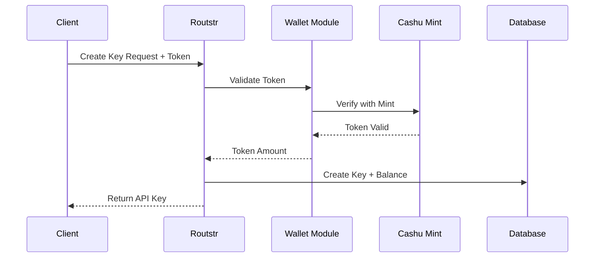

# Architecture Overview

This document describes the high-level architecture of Routstr Core, helping contributors understand how the system works.

## System Overview

Routstr Core is a FastAPI-based reverse proxy that adds Bitcoin micropayments to OpenAI-compatible APIs.



## Core Components

### FastAPI Application

The main application is initialized in `routstr/core/main.py`:

- **Lifespan Management**: Handles startup/shutdown tasks
- **Middleware**: CORS, logging, error handling
- **Routers**: Modular endpoint organization
- **Background Tasks**: Price updates, automatic payouts

### Authentication System

Located in `routstr/auth.py`, handles:

- **API Key Validation**: Hashed key storage and lookup
- **Balance Checking**: Ensures sufficient funds
- **Rate Limiting**: Optional request throttling
- **Token Redemption**: Converts eCash to balance

### Payment Processing

The `routstr/payment/` module manages:

- **Cost Calculation**: Token-based or fixed pricing
- **Model Pricing**: Dynamic pricing from models.json
- **Currency Conversion**: BTC/USD rate management
- **Fee Application**: Exchange and provider fees

### Request Proxying

`routstr/proxy.py` handles:

- **Request Forwarding**: Preserves headers and body
- **Response Streaming**: Efficient memory usage
- **Usage Tracking**: Counts tokens and costs
- **Error Handling**: Graceful upstream failures

### Database Layer

Using SQLModel in `routstr/core/db.py`:

```python
# Core models
APIKey:
  - id: Primary key
  - key_hash: Hashed API key
  - balance: Current balance (msats)
  - created_at: Timestamp
  - metadata: JSON field

Transaction:
  - id: Primary key
  - api_key_id: Foreign key
  - amount: Transaction amount
  - type: deposit/usage/withdrawal
  - timestamp: When occurred
```

## Request Flow

### Standard API Request



### Payment Flow



## Key Design Decisions

### 1. Async Architecture

Everything is async for maximum performance:

```python
async def handle_request(request: Request) -> Response:
    # Non-blocking database queries
    api_key = await get_api_key(request.headers["Authorization"])
    
    # Concurrent operations
    balance_check, rate_limit = await asyncio.gather(
        check_balance(api_key),
        check_rate_limit(api_key)
    )
    
    # Stream response without blocking
    async for chunk in proxy_request(request):
        yield chunk
```

### 2. Modular Design

Components are loosely coupled:

- **Routers**: Separate files for different endpoints
- **Dependencies**: Injected via FastAPI's DI system
- **Models**: Shared data structures
- **Services**: Business logic separated from routes

### 3. Error Handling

Graceful degradation and clear error messages:

```python
class RoustrError(Exception):
    """Base exception with structured error response"""
    status_code: int = 500
    error_type: str = "internal_error"
    
class InsufficientBalanceError(RoustrError):
    status_code = 402
    error_type = "insufficient_balance"
```

### 4. Database Migrations

Using Alembic for schema management:

- Auto-migrations on startup
- Version control for schema changes
- Rollback capability
- Zero-downtime updates

## Security Architecture

### API Key Security

- **Storage**: SHA-256 hashed keys
- **Generation**: Cryptographically secure random
- **Validation**: Constant-time comparison
- **Rotation**: Support for key expiry

### Payment Security

- **Token Validation**: Cryptographic verification
- **Double-Spend Prevention**: Mint verification
- **Balance Protection**: Atomic transactions
- **Audit Trail**: All transactions logged

### Network Security

- **HTTPS**: Enforced in production
- **CORS**: Configurable origins
- **Rate Limiting**: Per-key limits
- **Input Validation**: Pydantic models

## Performance Considerations

### Caching Strategy

```python
# Model pricing cache
@lru_cache(maxsize=100)
def get_model_price(model_id: str) -> ModelPrice:
    return MODELS.get(model_id)

# Balance cache with TTL
balance_cache = TTLCache(maxsize=1000, ttl=60)
```

### Database Optimization

- **Connection Pooling**: Reuse connections
- **Indexed Queries**: Key lookups are O(1)
- **Batch Operations**: Group updates
- **Async I/O**: Non-blocking queries

### Streaming Responses

Efficient memory usage for large responses:

```python
async def stream_response(upstream_response):
    async for chunk in upstream_response.aiter_bytes():
        # Process chunk without loading full response
        yield process_chunk(chunk)
```

## Extension Points

### Adding New Endpoints

1. Create router module
2. Define Pydantic models
3. Implement business logic
4. Register with main app
5. Add tests

### Custom Pricing Models

1. Extend `ModelPrice` class
2. Implement calculation logic
3. Add to pricing registry
4. Update configuration

### Payment Methods

1. Create payment handler
2. Implement validation
3. Add to payment router
4. Update balance logic

## Testing Strategy

### Unit Tests

- Mock external dependencies
- Test business logic in isolation
- Fast execution (< 1 second per test)
- High coverage target (> 80%)

### Integration Tests

- Test component interactions
- Use test database
- Mock external services
- Verify end-to-end flows

### Performance Tests

- Load testing with locust
- Memory profiling
- Database query optimization
- Response time benchmarks

## Monitoring and Observability

### Structured Logging

```python
logger.info("api_request", extra={
    "request_id": request_id,
    "api_key": api_key_id,
    "endpoint": endpoint,
    "model": model,
    "tokens": token_count,
    "cost_sats": cost,
    "duration_ms": duration
})
```

### Metrics Collection

Key metrics tracked:

- Request rate by endpoint
- Token usage by model
- Balance changes
- Error rates
- Response times

### Health Checks

```python
@app.get("/health")
async def health_check():
    return {
        "status": "healthy",
        "version": __version__,
        "database": await check_db(),
        "upstream": await check_upstream(),
        "mints": await check_mints()
    }
```

## Deployment Architecture

### Container Structure

```dockerfile
# Multi-stage build
FROM python:3.11-slim AS builder
# Install dependencies

FROM python:3.11-slim
# Copy only runtime needs
# Run as non-root user
```

### Environment Configuration

- **Development**: Local SQLite, debug logging
- **Testing**: In-memory database, mock services
- **Production**: Persistent storage, structured logs

### Scaling Considerations

- **Horizontal**: Multiple instances behind load balancer
- **Vertical**: Async handles high concurrency
- **Database**: Consider PostgreSQL for scale
- **Caching**: Redis for distributed cache

## Future Architecture

### Planned Improvements

1. **WebSocket Support**: Real-time balance updates
2. **Plugin System**: Extensible pricing/auth
3. **Multi-Region**: Geographic distribution
4. **Event Sourcing**: Complete audit trail

### Technical Debt

Areas for improvement:

- Database query optimization
- Response caching layer
- Metric aggregation
- API versioning strategy

## Next Steps

- Review [Code Structure](code-structure.md) for detailed organization
- See [Testing Guide](testing.md) for test architecture
