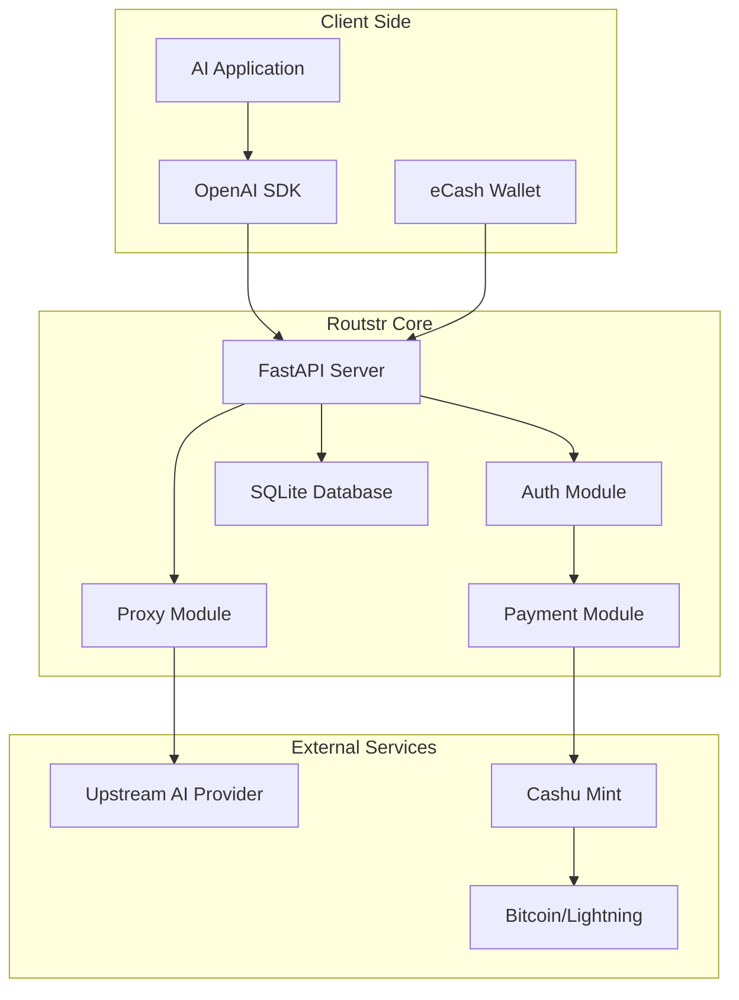

# Overview

Routstr Core is a powerful payment proxy that brings Bitcoin micropayments to AI APIs. This overview will help you understand the core concepts and architecture.

## Core Concepts

### Payment Proxy

Routstr acts as a transparent proxy between your application and OpenAI-compatible APIs. It:

- Intercepts API requests
- Validates payment tokens
- Forwards requests to the upstream provider
- Tracks usage and deducts costs
- Returns responses to the client

### Cashu eCash Protocol

[Cashu](https://cashu.space) is a Bitcoin eCash protocol that enables:

- **Privacy**: Payments are unlinkable and untraceable
- **Instant Settlement**: No waiting for blockchain confirmations
- **Micropayments**: Send fractions of a satoshi
- **Offline Capability**: Tokens can be transferred without internet

### Lightning Network Integration

Routstr connects to the Lightning Network through Cashu mints, enabling:

- Fast Bitcoin deposits and withdrawals
- Global payment reach
- Low transaction fees
- No minimum payment amounts

## Architecture

### System Components

### Key Modules

1. **Authentication** (`auth.py`)
   - API key validation
   - Balance checking
   - Request authorization

2. **Payment Processing** (`payment/`)
   - Token validation
   - Cost calculation
   - Balance updates
   - Pricing models

3. **Proxy Handler** (`proxy.py`)
   - Request forwarding
   - Response streaming
   - Usage tracking
   - Error handling

4. **Wallet Management** (`wallet.py`)
   - Cashu wallet integration
   - Token redemption
   - Balance management
   - Automatic payouts

5. **Admin Interface** (`core/admin.py`)
   - Web dashboard
   - Balance viewing
   - Key management
   - Withdrawal interface

## Payment Flow

### Standard Flow (API Key)

1. User deposits eCash tokens to create an API key
2. Client sends requests with the API key
3. Routstr checks balance and forwards request
4. Cost is deducted based on actual usage
5. Response is returned to client

### Per-Request Flow (Coming Soon)

1. Client includes eCash token in request header
2. Routstr validates token meets minimum amount
3. Request is processed
4. Change is returned in response header
5. No account or balance needed

## Supported Features

### API Compatibility

- ✅ Chat completions (streaming and non-streaming)
- ✅ Text completions
- ✅ Embeddings
- ✅ Image generation
- ✅ Audio transcription/translation
- ✅ Model listing
- ✅ Custom endpoints

### Payment Features

- ✅ Multiple Cashu mint support
- ✅ Automatic balance tracking
- ✅ Model-based pricing
- ✅ USD to BTC conversion
- ✅ Configurable fees
- ✅ Balance withdrawals

### Operational Features

- ✅ Docker deployment
- ✅ Tor hidden service support
- ✅ Nostr relay discovery
- ✅ Database migrations
- ✅ Comprehensive logging
- ✅ Admin dashboard

## Next Steps

- [Quick Start](quickstart.md) - Get running in minutes
- [Docker Setup](docker.md) - Deploy with containers
- [Configuration](configuration.md) - Customize your instance