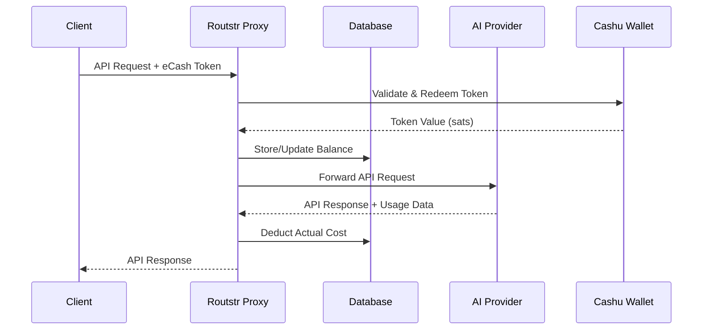

# Routstr Core Documentation

Welcome to the official documentation for **Routstr Core** - a FastAPI-based reverse proxy that enables Bitcoin micropayments for OpenAI-compatible APIs using the Cashu eCash protocol.

## What is Routstr Core?

Routstr Core is a payment proxy that sits between API clients and OpenAI-compatible services. It enables:

- **Pay-per-request billing** using Bitcoin eCash tokens
- **Seamless integration** with existing OpenAI clients
- **Privacy-preserving payments** through the Cashu protocol
- **Flexible pricing models** with per-token or per-request billing
- **Multi-provider support** for various AI model providers

### Key Features

- 🪙 **Cashu Wallet Integration** - Accept Lightning payments and redeem eCash tokens
- 🔑 **API Key Management** - Secure key storage with balance tracking
- 💰 **Dynamic Pricing** - Model-based pricing with live BTC/USD conversion
- 🎛️ **Admin Dashboard** - Web interface for balance and key management
- 🌐 **Nostr Discovery** - Find providers through decentralized relay network
- 🐋 **Docker Support** - Easy deployment with optional Tor hidden service
- ⚡ **Lightning Fast** - Minimal latency overhead for API requests

## How It Works

## Quick Links

- :rocket: **[Quick Start](getting-started/quickstart.md)**

    Get up and running with Docker in minutes

- :gear: **[Configuration](getting-started/configuration.md)**

    Learn about environment variables and settings

- :book: **[User Guide](user-guide/introduction.md)**

    Comprehensive guide for using Routstr

- :hammer: **[Contributing](contributing/setup.md)**

    Help improve Routstr Core

## Use Cases

- **AI Application Developers** - Add Bitcoin payments to your AI apps without managing infrastructure
- **API Resellers** - Resell API access with custom pricing and profit margins
- **Privacy-Focused Users** - Access AI models without revealing personal information
- **Micropayment Experiments** - Test new business models with instant, small payments

## Getting Help

- 📖 Browse the [User Guide](user-guide/introduction.md) for detailed usage instructions
- 🐛 Report issues on [GitHub](https://github.com/routstr/routstr-core/issues)
- 💬 Join the community discussions
- 🔧 Check the [API Reference](api/overview.md) for technical details

## License

Routstr Core is open source software licensed under the GPLv3. See the [LICENSE](https://github.com/routstr/routstr-core/blob/main/LICENSE) file for details.
