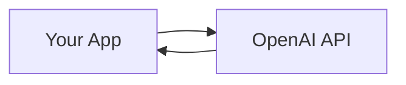
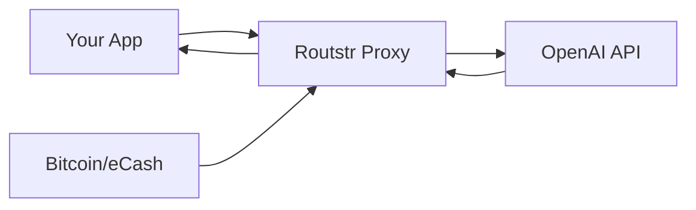

# User Guide Introduction

Welcome to the Routstr Core User Guide. This guide will help you understand how to use Routstr to access AI APIs with Bitcoin micropayments.

## What You'll Learn

- How the payment system works
- Creating and managing API keys
- Making API calls through Routstr
- Using the admin dashboard
- Managing your balance

## Prerequisites

Before starting, you'll need:

1. **A Running Routstr Instance**
   - Either your own deployment or access to a public node
   - The base URL (e.g., `https://api.yournode.com`)

2. **A Cashu Wallet** (optional but recommended)
   - [Nutstash](https://nutstash.app) - Web wallet
   - [Minibits](https://www.minibits.cash) - Mobile wallet
   - [Cashu.me](https://cashu.me) - Simple web wallet

3. **An API Client**
   - OpenAI Python/JavaScript SDK
   - Any HTTP client (curl, Postman, etc.)
   - Your application code

## How Routstr Works

### Traditional API Access



- Direct connection to provider
- Monthly billing
- Credit card required
- Usage limits

### With Routstr



- Pay per request with Bitcoin
- No credit card needed
- Anonymous payments
- Instant settlement

## Key Concepts

### eCash Tokens

- Digital bearer tokens backed by Bitcoin
- Can be sent like cash - whoever has the token owns it
- Redeemable at Cashu mints for Bitcoin
- Perfect for micropayments

### API Keys

- Created by depositing eCash tokens
- Track your balance and usage
- Can be topped up anytime
- Optional expiry and refund address

### Balance Management

- Measured in millisatoshis (msats)
- 1 Bitcoin = 100,000,000 sats = 100,000,000,000 msats
- Deducted based on actual usage
- Withdrawable as eCash tokens

## Typical Workflow

### 1. Get Bitcoin/eCash

Options:
- Buy Bitcoin and deposit to a Cashu mint
- Receive eCash tokens from someone else
- Use a testnet mint for testing

### 2. Create API Key

Send your eCash token to Routstr:
```bash
POST /v1/wallet/create
{
  "cashu_token": "cashuAeyJ0..."
}
```

Receive your API key and balance.

### 3. Make API Calls

Use your API key like any OpenAI key:
```python
client = OpenAI(
    api_key="your-routstr-key",
    base_url="https://your-routstr-node/v1"
)
```

### 4. Monitor Usage

- Check balance: `GET /v1/wallet/balance`
- View admin dashboard
- Track costs per request

### 5. Withdraw Funds

When done, withdraw remaining balance as eCash through the admin interface.

## Supported Endpoints

Routstr supports all standard OpenAI endpoints:

- ✅ `/v1/chat/completions` - Chat models
- ✅ `/v1/completions` - Text completion
- ✅ `/v1/embeddings` - Text embeddings
- ✅ `/v1/images/generations` - Image generation
- ✅ `/v1/audio/transcriptions` - Audio to text
- ✅ `/v1/audio/translations` - Audio translation
- ✅ `/v1/models` - List available models
- ✅ Custom provider endpoints

## Cost Structure

### Pricing Models

1. **Fixed Cost Per Request**
   - Simple flat fee per API call
   - Good for uniform usage

2. **Token-Based Pricing**
   - Pay per input/output token
   - More accurate for varied usage

3. **Model-Based Pricing**
   - Different rates per model
   - Reflects actual provider costs

### Cost Calculation

```
Total Cost = Base Fee + (Input Tokens * Input Rate) + (Output Tokens * Output Rate)
```

Fees may include:
- Exchange rate markup (BTC/USD conversion)
- Provider margin
- Node operator fee

## Getting Support

### Documentation

- This user guide for general usage
- [API Reference](../api/overview.md) for technical details
- [Contributing Guide](../contributing/setup.md) for developers

### Community

- GitHub Issues for bugs and features
- Nostr for decentralized discussion
- Node operator contact info

### Troubleshooting

Common issues and solutions:
- [Payment Flow](payment-flow.md) - Understanding the payment process
- [Using the API](using-api.md) - API integration guide
- [Admin Dashboard](admin-dashboard.md) - Managing your node

## Security Considerations

### API Key Security

- Treat API keys like passwords
- Never share or commit them
- Rotate keys regularly
- Use environment variables

### Payment Security

- eCash tokens are bearer instruments
- Verify mint trustworthiness
- Keep backups of tokens
- Use small amounts for testing

### Network Security

- Always use HTTPS connections
- Verify SSL certificates
- Consider using Tor for privacy
- Monitor for unusual activity

## Next Steps

Ready to start? Continue with:

1. [Payment Flow](payment-flow.md) - Detailed payment process
2. [Using the API](using-api.md) - Making your first calls
3. [Admin Dashboard](admin-dashboard.md) - Managing your account